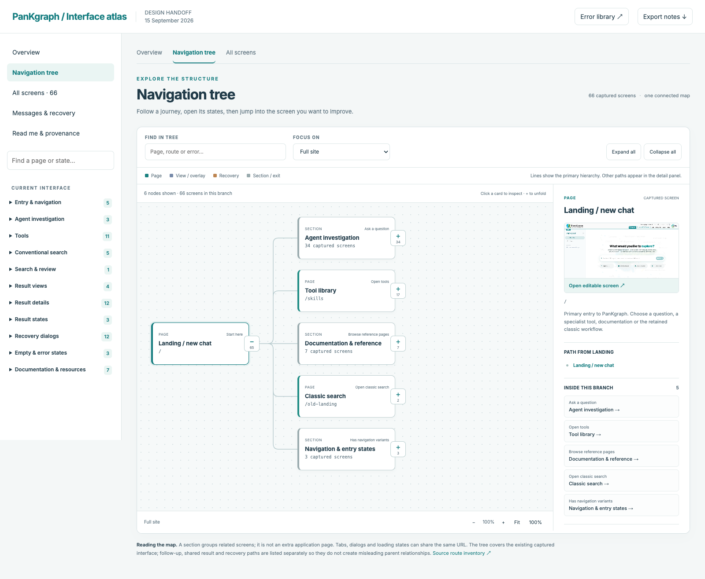

# PanKgraph designer atlas

A versioned design reference for the current isolated vNext interface and its classic routes: **66 linked screens/states**, **29 mapped page families**, and **215 error/message entries**.



## Open it

Download or clone this repository, then open **[START-HERE.html](START-HERE.html)** locally. The atlas works offline, without a server, login or API calls. GitHub displays HTML source rather than running it; download the directory/repository to use the interactive reference.

To open the tree directly, double-click **[NAVIGATION-TREE.html](NAVIGATION-TREE.html)**. This uses the local files and does not depend on a running localhost preview server. Keep the full atlas folder together.

- **[Navigation tree](index.html#view=navigation)** — a connected, expandable map of all 66 captures, with route/state distinctions and shared navigation paths.
- **[Overview](index.html)** — a summary of the main page families and journeys.
- **[Error library](errors.html)** — exact message copy, conditions, recovery, source references and proposed rewrites.
- **[Screens](pages/)** and **[reference screenshots](screenshots/)** — page HTML and matching PNGs.
- **[Coverage](inventories/page-coverage.md)** — route-family mapping, aliases and documented exclusions.

You may also preview over local HTTP from the repository root:

```sh
python3 -m http.server 8000 --bind 127.0.0.1 --directory design/pankgraph-atlas
```

Open `http://127.0.0.1:8000/`.

## Navigate the tree

Choose the **Navigation tree** tab. Use **+ / −** on a card to expand or collapse its children; the small number counts captures below it. Select a card to see its screenshot, path from landing, and links to related flows. **Open editable screen** enters the existing screen editor, which includes a link back to its position in the tree.

Search reveals a page and its ancestors, including inside collapsed branches. **Focus on** isolates a main journey; **Expand all**, **Collapse all**, zoom and **Fit** control the canvas. Scroll horizontally and vertically to explore a large branch. Keyboard users can tab through the controls; when the diagram is focused, use arrow keys to scroll and `+`, `−`, or `0` to zoom or fit.

Solid connections show the primary hierarchy; dashed connections lead to views, overlays or recovery states. Section nodes organize the reference and do not imply extra application routes. The detail panel lists shared paths separately, including QTL/GWAS selection, follow-up and eligible retries. Operator-only errors do not imply a working retry. External destinations are labeled exits; the functional tool’s Step 2 plot interpretation links to the structured result, while Step 3 trait interpretation is disabled. Shared panel captures appear as related references. The tree reorganizes this dated snapshot for review; it does not change the application router.

## Edit and review

| What you want to change | Files |
| --- | --- |
| Page content / layout | `pages/<screen-id>.html`; follow its stylesheet links into `styles/` |
| Page title, parent, description or provenance | `pages/<screen-id>.meta.json` |
| Logical tree hierarchy and cross-links | `navigation-data.js` |
| Tree canvas, search, focus and detail panel | `navigation-tree.js`, `navigation-tree.css` |
| Atlas navigation and frame controls | `atlas.js`, `atlas.css`, `index.html` |
| Exact error catalog / source references | `inventories/error-catalog.json` |
| Error library layout | `errors.html` (outside its generated `catalog-data` block) |
| Shared screen controls | `page-runtime.js` |
| Images and fonts | `assets/`; original public URLs are in `assets/source-provenance.json` |

After editing metadata or the error catalog, regenerate the derived indexes:

```sh
python3 design/pankgraph-atlas/scripts/sync.py
python3 design/pankgraph-atlas/scripts/check.py
```

The browser's **Edit text** control allows copy experiments. Click the text before typing, then save an edited HTML copy **inside `pages/`** so its shared assets resolve. For changes to track in Git, replace the intended page with your edited copy, inspect the diff, and commit it. Review notes and proposed error rewrites can be exported as JSON; they do not modify application code.

Graphs are canvas image captures; text, tables, controls and forms remain HTML. Captured navigation connects representative states. Live searches, model calls and submissions are disabled. External PanKbase destinations remain external exits.

### Make a portable standalone handoff

```sh
python3 design/pankgraph-atlas/scripts/export.py
```

This writes ignored `dist/pankgraph-designer-atlas/`, embedding each page's shared styles, fonts, images and scripts. These exported page files preserve their appearance when copied elsewhere. Share the exported directory for the linked atlas. Generated exports and ZIPs are excluded from Git; the shared source files keep diffs and repository size manageable.

## Snapshot and data boundary

Captured on **2026-09-15** from the existing local build of **2026-09-14**, `main.120ca8e2.js`. The frontend source was `vnext-jieliu3-demo` at `6dcea1d7e269f358ab9486d1f6ee52bfa66af181` plus existing uncommitted source changes. The source audit uses the corresponding current backend working tree, based on `e4e24eaf603c194d9f5d6abda7d8a5310285fd63`. This is a dated design snapshot; it does not claim the public production site serves the same build.

Dynamic result and cohort fixtures are synthetic and explicitly labeled. One public tutorial screenshot that contained donor identifiers was replaced by a synthetic tool capture before this GitHub publication. The original donor image, unused API guides, private runtime paths, captured credentials and actual donor tables are excluded. Static source-written counts are reproduced as existing UI copy, not freshly verified scientific denominators. See [publication notes](inventories/publication-notes.md).

The error catalog contains 108 active frontend entries, 46 backend-exposed entries, 8 dynamic contracts, 29 standalone agent-service entries, 22 inactive HIRN entries and 2 standalone developer-viewer entries. The default library shows the 162 current/exposed/dynamic entries. An implementation annex lists 281 internal diagnostics. Dynamic semantic, browser and provider messages cannot be enumerated as a finite set of future literal strings; their display contracts are documented. [Coverage and design gaps](inventories/coverage.md) distinguish failures, missing evidence and biological absence.

The standalone operator UI and graph-layout developer demo are documented in the inventory rather than mixed into main-site screens. Documentation has one representative concept page; the distinct ontology, statistics, sources, pipeline, tutorial and use-case layouts are also captured.

## Validation

Run `scripts/check.py` for local-link, asset, source-index and private-path checks. The original capture verification is recorded in `inventories/github-verification.json`. Local tree, keyboard, cross-link and responsive verification is recorded in `inventories/navigation-verification.json`. No live application endpoint, model inference or production deployment is part of this handoff.
